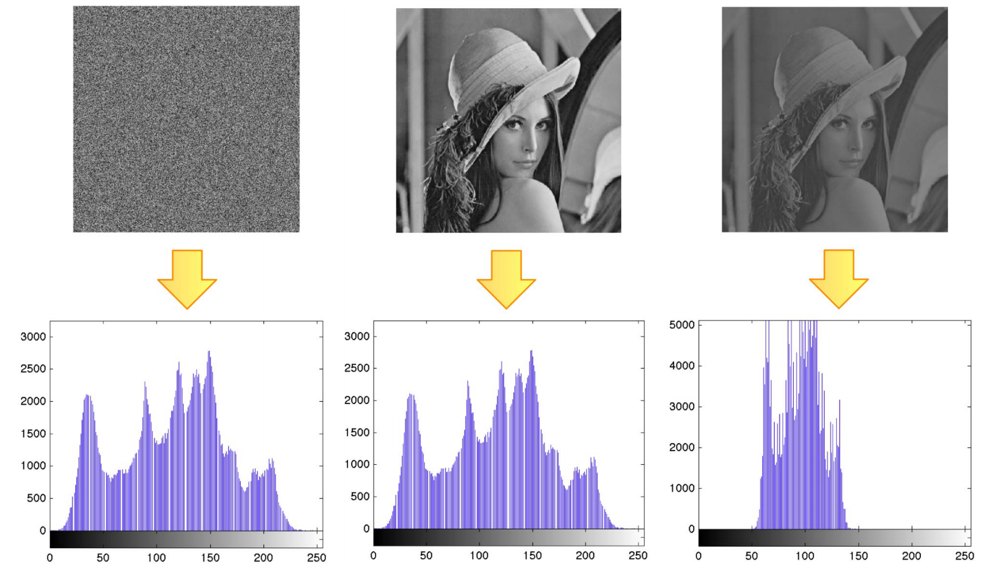
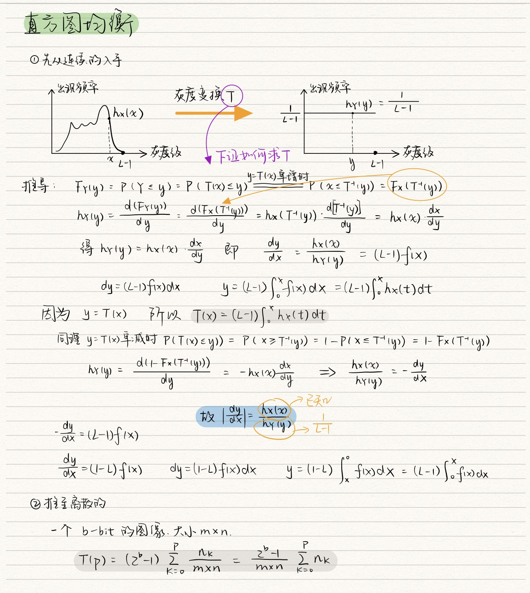
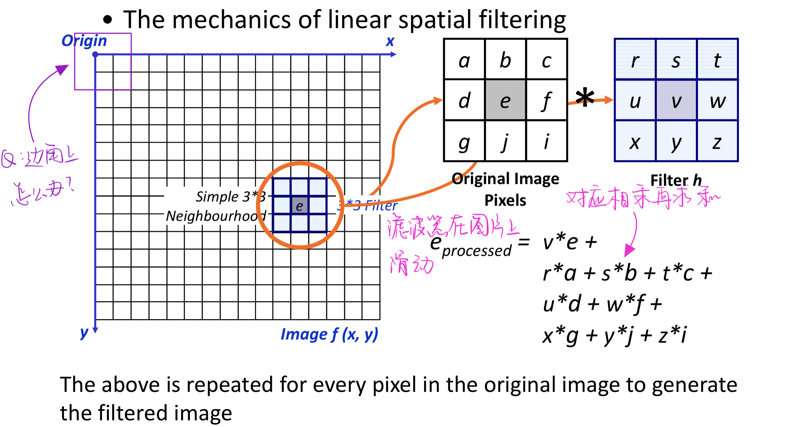
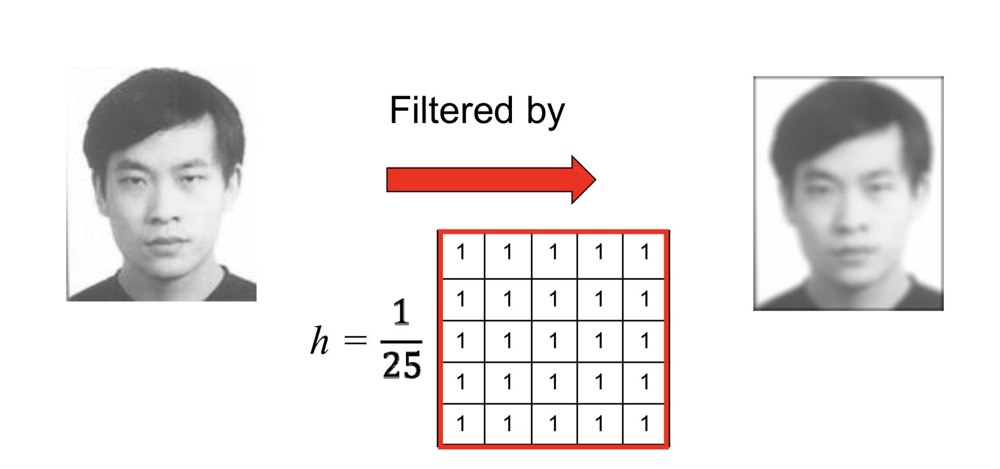
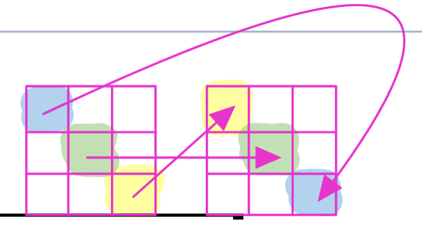
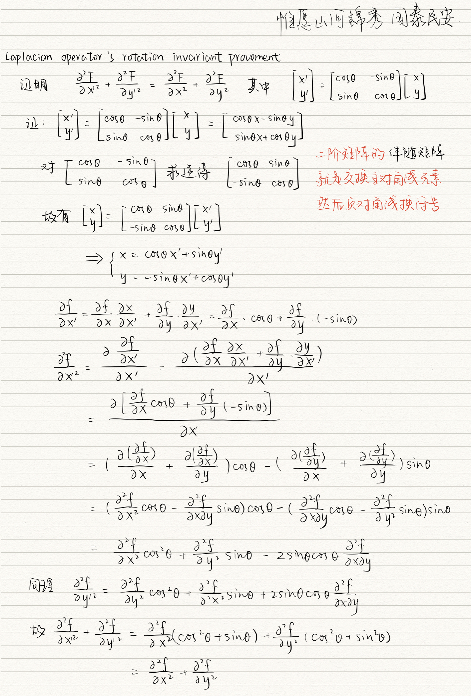

# 第3章 灰度变换与空间滤波

[toc]


## 引言

* 空间域：图像平面本身，直接以图像中的像素操作为基础
* 频域：与空间域相对，在傅立叶变换或小波变换后的图片上操作；先将图片从空域变换到频域，然后在频域上处理，最后变回空域。
* 空间域处理
  * 灰度变换：在图像的单个像素上操作，主要以对比度和与之处理为目的
  * 空间滤波：涉及改善性能的操作，通过一个像素的邻域来锐化图像

## 3.1 图像增强

* 定义：使图片更加有用的过程

* 做图像增强的原因

  * 强调感兴趣的细节
  * 去噪
  * 让图片看起来更吸引人

* 大部分的空间域图像增强可以用这个公式来表示

  * $g(x,y)=T[f(x,y)]$其中$f(x,y)$是输入的图片，$g(x,y)$是转换后的图片，T是一系列在$(x,y)$像素领域上的操作

  


## 3.2 一些基本的灰度变换函数

### 3.2.1 图像反转（Image Negatives）

* 一个灰度级为[0, L-1]的图片的反转为 $s=T(r)=L-1-r$
* 用途：用于强调嵌入深色区域的白色或灰色，尤其是当深色区域占支配地位时
* 
* MATLAB代码：

```matlab
A=imread("pic.jpg");% 此处pic.jpg是一个灰度图
B=255-A;
```


### 3.2.2 下限变换（Threshold Transformation）

$$
s=\left\{\begin{aligned}1&,r>threshold\\0&,otherwise\end{aligned}\right.
$$

* 用途：用于将一个感兴趣的物体从背景中分割出来
* 

* MATLAB代码

```matlab
BWp=(A>level);
% 这句话的意思是将大于level的部分置为1，其余置为0
```


### 3.2.3 对数变换（Log Transformation）

$$
s=c*log(1+r)\ \ where\  c\ is\ a\ constant\ and\ r>=0
$$

* 用途：让暗的地方变量，将图中暗的地方拉伸
* 


### 3.2.4 指数变换（伽马变换）

$$
s=cr^\gamma \ where \ c\ and \ \gamma \ are\ positive\ constants
$$

* $\gamma$取值不同会有不同效果，$\gamma>1$ 暗部压缩、亮部扩展；$\gamma<1$ 亮部压缩、暗部扩展


### 3.2.5 其他对比度拉伸函数

$$
s=\frac{1}{1+(m/r)^E}
$$


* <0.2的部分都变成黑色了
* \> 0.8的部分都变成白色了
* 0.2~0.8的部分被拉伸到0～1.0

### 3.2.6 分段线性变换

* 优点：其形式可以任意复杂

* 缺点：他们的规范需要更多的用户输入

* 三个常用的分段线性变换

  * 对比度拉伸

    * 定义：扩展一个图片中的灰度级，使得该图片中的的灰度值能够跨越记录媒介或展示设备的整个灰度级
    * 

  * 灰度级切片突出

    * 定义：突出强调图片中的某个灰度区间的像素值
    * 

  * 🌟比特平面分层

    * 定义：将每个比特层分离出来

    * 分离方法：一个由8比特表示的图片，每个像素点都可以用八位数来表示，例如

    * $$
      (x_7x_6x_5x_4x_3x_2x_1x_0)_B = x_0*2^0+x_1*2^1+...+x_7*2^7
      $$

    * 那么，如果将每个像素点的最高位都取出来，用$x_7*2^7$代替原来的像素值，得到的就是**Bit-plane7**，其他7个层同理，就会得到8个层各自的图片（如下）

    * 

    * 观察这八个层易得，图片层数越大，越接近原始图片

    * 应用🌰：图片压缩——5、6、7三个层叠加起来其实就和原图比较接近了，这样在图像传输的时候每个像素点只需要传3个bit位就行了，节省了一半多的数据传输需要

    * 

## 3.3 灰度直方图

### 3.3.1 概率密度函数和概率分布函数

#### 1. 概率密度函数（Probability Density Function，PDF）

一个==连续==自由变量的概率密度函数是描述该变量概率密度的分布情况的函数。它满足下列条件：

(1)  $f(x)\geq0,\int_{-\infty}^{+\infty}f(t)dt=1$

(2)  $P(x_1<X\leq x_2)=F(x_2)-F(x_1)=\int_{x_1}^{x_2}f(t)dt$

(3)如果f(x)是连续的，那么$F'(x)=f(x)$

#### 2. 概率分布函数（Cumulative Distribution Function，CDF）

一个实数自由变量X的概率分布函数F(x)的定义如下：
$$
F(x)=P(X\leq x)=\int_{-\infty}^{x}f(t)dt\\
P(a<X\leq b)=F(b)-F(a)=\int_{a}^bf(t)dt
$$

#### 3. 期望（Expectation）

一个自由变量X的期望指的是$E(X)=\int_{-\infty}^{+\infty}xf(x)dx$

其实就是X的各种可能取之的加权平均数

**定理**
$$
if\ \ Y=g(X)\\then\ \ E(Y)=E(g(X))=\int_{-\infty}^{+\infty}g(x)f(x)dx
$$

#### 4. 方差（Variance）

方差是用来衡量离散程度的，一个自由变量X的方差定义为：
$$
D(X)=E{[X-E(x)]^2}=\int_{-\infty}^{+\infty}(x-E(X))^2f(x)dx
$$
方差开方是标准差

#### 5. 方差和均值的关系

$$
D(X)=E(X^2)-[E(X)]^2
$$

#### 6. 协方差（Covariance）

$$
Cov(X,Y)=E{[X-E(X)][Y-E(Y)]}
$$

相关系数  $\rho_{XY}=\frac{cov(X,Y)}{\sqrt{D(X)}\sqrt{D(Y)}}$

### 3.3.2 直方图📊（histogram）

* 定义：统计图片中各种灰度值的像素出现的次数。假设$f$是一副b比特位的图片，满足$f:\Omega \rightarrow [0,2^b-1]$,那么$h(x)$为$f$中向素质为x的像素点的个数。

  

* 定理
  $$
  \sum_{x=0}^{2^b-1}=图片的像素面积
  $$
  
* ⚠️$h(x)$只跟出现的次数有关而与位置无关，图片和直方图是多对一的，所以知道$h(x)$无法倒推回原来的图片。



当然可以用这个方法来增强图像对比度，这就是**直方图均衡法**

### 3.3.3 直方图均衡（Histogram Equalization）

* 动机：当一个图片的像素分布在整个可取的灰度级上，且分布比较均匀的话，图片的对比度就会比较高

#### 3.3.3.1 直方图均衡算法（证明过程）




## 3.4 基本的空间域滤波

### 3.4.1 线性变换

```
input image: f(x,y)
transform: H[f(x,y)] = g(x,y)
H is said to be a linear operator if
```

$$
\begin{align}
&H[a_if_i(x,y)+a_jf_j(x,y)]\\&=a_iH[f_i(x,y)]+a_jH[f_j(x,y)]\\ &=a_ig_i(x,y)+a_jg_j(x,y)
\end{align}
$$

✨滤波器可以分为线性和非线性两种，本课程只涉及线性的

### 3.4.2 线性空间域滤波

#### 3.4.2.1 机制

一个权重mask -> kernel 在图片上扫描，对每个图像块进行加权处理，得到的结果就是处理后的图像。



#### 3.4.2.2 相关操作的公式(correlation)

$$
\begin{align}
	g(x,y)=\sum_{s=-a}^a\sum_{t=-b}^b{h(s,t)f(x+s,y+t)}\\where\ a\ and\ b\ are\ the\ half\ width\ and\ half\ height
\end{align}
$$

#### 3.4.2.3 均值滤波（mean filter）

作用：使图像变模糊，有一定去燥效果，代价就是损失清晰度
$$
h=\frac{1}{9} \begin{bmatrix}1&1&1\\1&1&1\\1&1&1\end{bmatrix}\\size: 3*3
$$

$$
h=\frac{1}{25} \begin{bmatrix}1&1&1&1&1\\1&1&1&1&1\\1&1&1&1&1\\1&1&1&1&1\\1&1&1&1&1\end{bmatrix}\\size: 5*5
$$



#### 3.4.2.4 卷积操作的公式（Convolution）

$$
\begin{align}
	g(x,y)=\sum_{s=-a}^a\sum_{t=-b}^b{h(s,t)f(x-s,y-t)}\\where\ a\ and\ b\ are\ the\ half\ width\ and\ half\ height
\end{align}
$$

==相当于把相关操作的kernel旋转了180度👇==
$$
\begin{align}
	g(x,y)&=\sum_{s=-a}^a\sum_{t=-b}^b{h(s,t)f(x-s,y-t)}\\&\xlongequal{s'=-s\&t'=-t}\sum_{s'=a}^{-a}\sum_{t'=b}^{-b}h(-s',-t')f(x+s',y+t')\\&=\sum_{s=-a}^{a}\sum_{t=-b}^{b}h(-s,-t)f(x+s,y+t)
\end{align}
$$


⚠️从数学角度来看**卷积的效果比相关的效果要好**，所以线性滤波通常指的是卷积，而非相关

对于连续变化量的一维卷积公式
$$
f(t)*h(t)=\int_{-\infin}^{+\infin}f(t-\tau)h(\tau)d\tau
$$

#### 3.4.2.5卷积的性质

1. $$
   交换律：f_1(t)*f_2(t)=f_2(t)*f_1(t)
   $$
   
2. $$
   分配律：f_1(t)*(f_2(t)+f_3(t))=f_1(t)*f_2(t)+f_1(t)*f_3(t)
   $$

3. $$
结合律：f_1(t)*(f_2(t)*f_3(t))=(f_1(t)*f_2(t))*f_3(t)
   $$
   
   

## 3.4 平滑空间过滤器

### 3.4.1机制

* 通过对图像中每个像素周围的像素做（加权）平均，削弱或去掉图像上剧烈的转变
* 由于是低通滤波器，会付出使图片边缘变模糊的代价
* 可以减少图片中不相关细节，突出主要的物体，起到去燥效果

### 3.4.2 高斯滤波器

* 定义：一个线性滤波器，权重是由高斯函数算出来的
* 特性：中间的权重高，边上的权重低

#### 3.4.2.1 高斯滤波器公式

$$
G(x,y)=\frac{1}{2\pi\sigma^2}\exp(-\frac{x^2+y^2}{2\sigma^2})
$$

> ⚠️高斯核大小和$\sigma$之间的关系
>
> 通常$size = \sigma*3*2+1$
>
> 因为3$\sigma$原则，3$\sigma$内包含了99.74%的内容
>
> $\sigma$的物理意义在于   它越大，周围点对中间点的贡献度越高

#### 3.4.2.2 高斯滤波器的三条性质

1. 低通滤波器，过滤掉高频噪声
2. 和自己做卷积还是高斯滤波器
3. 可以分成两个低维的高斯滤波器（源于高斯函数的性质）

### 3.4.3 三种常见噪声

#### 3.4.3.1 椒盐噪声（Salt and Pepper noise）

* 定义：随机分布的黑白像素噪声
* 处理方法：中值滤波（Median Filter）

##### 中值滤波（Median Filter）

⚠️不是线性滤波器！！

* 方法：用周围$n*n$个像素点中，灰度值排序后居中的像素值代替中间那个像素点
* 特点：对异常点的鲁棒性

#### 3.4.3.2 冲击噪声（Impulse noise）

* 定义：随机分布的白像素噪声
* 处理方法：最小值滤波（Min Filter）顾名思义

#### 3.4.3.3 高斯噪声（Gaussian noise）

* 定义：概率密度函数服从高斯分布的噪声


## 3.5 锐化空间过滤器

* 目标：减少模糊、强化边缘

### 3.5.1 基础知识准备

#### 3.5.1.1 一阶导数

$$
\frac{\partial f}{\partial x}=f(x+1)-f(x)
$$

#### 3.5.1.2 二阶导数

$$
\frac{\partial ^2 f}{\partial x^2}=f(x+1)+f(x-1)-2f(x)
$$

### 3.5.2 Laplacian operator

* 基于二阶导数
* 用于边缘增强

#### 3.5.2.1 定义

连续表示
$$
\nabla^2f=\frac{\partial^2 f}{\partial x^2}+\frac{\partial^2 f}{\partial y^2}
$$
离散表示
$$
\nabla^2 f =f(x+1,y)+f(x,y+1)+f(x-1,y)+f(x,y-1)-4f(x,y)
$$

$$
\begin{bmatrix}
0&1&0\\1&-4&1\\0&1&0
\end{bmatrix}
$$

进一步考虑四个角，叠加得到
$$
\begin{bmatrix}1&1&1\\1&-8&1\\1&1&1\end{bmatrix}
$$

#### 3.5.2.2 拉普拉斯算子的旋转不变性及其 证明⚠️



#### 3.5.2.3 laplacian operator 锐化图片

$$
g(x,y)=f(x,y)+c[\nabla^2f(x,y)]
$$

