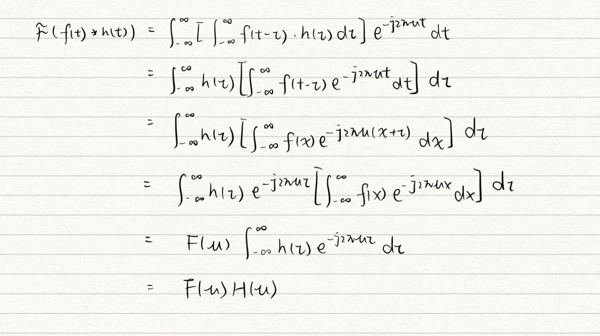
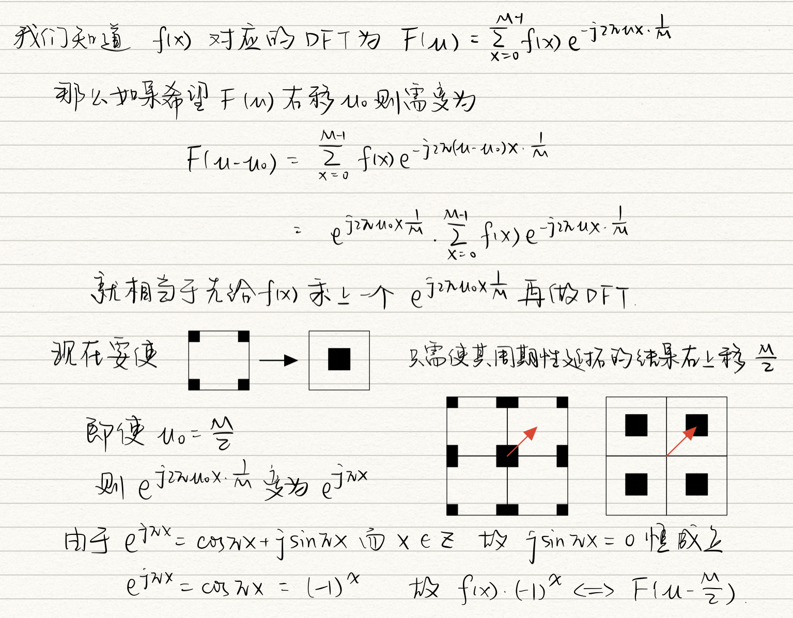
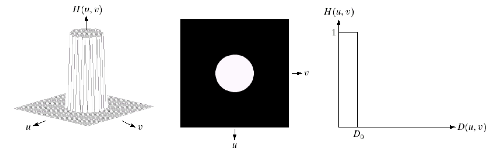
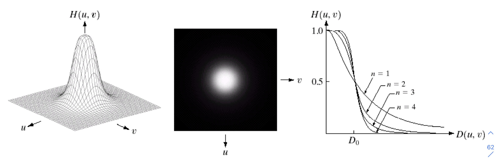
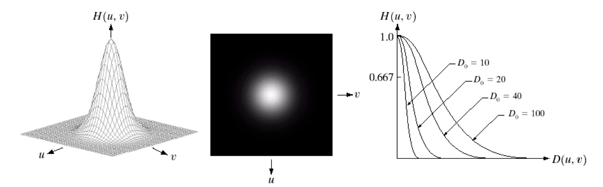
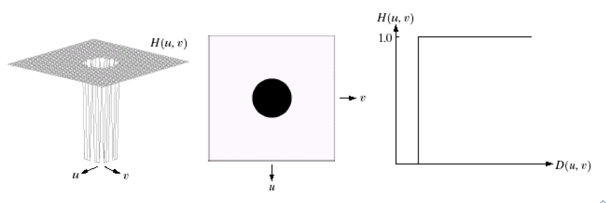
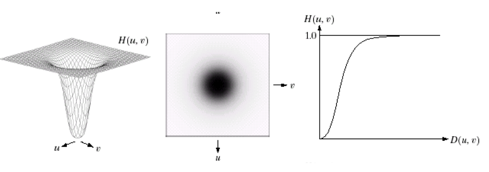
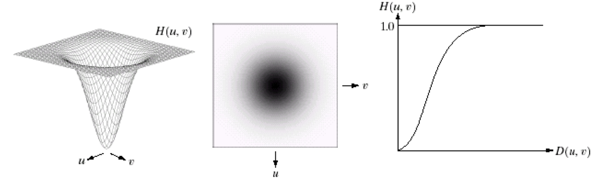

# 第4章 频域滤波
[toc]

## 4.1 基础知识准备

### 4.1.2  复数运算法则

* 加法：
  $$
  (a+bi)+(c+di)=(a+c)+(b+d)i
  $$

* 减法：
  $$
  (a+bi)-(c+di)=(a-c)+(b-d)i
  $$

* 乘法：
  $$
  (a+bi)*(c+di)=(ac-bd)+(ad+bc)i
  $$

* ==除法==：
  $$
  \frac{a+bi}{c+di}=\frac{(a+bi)(c-di)}{(c^2+d^2)}=\frac{(ac+bd)}{(c^2+d^2)}+\frac{(bc-ad)}{(c^2+d^2)}i
  $$

* 共轭：
  $$
  a+bi\ and\ a-bi
  $$

* 模：
  $$
  |a+bi|=\sqrt{a^2+b^2}
  $$

* ==欧拉公式==：
  $$
  e^{j\theta}=\cos{\theta}+j\sin{\theta}
  $$

  * 推论1: 
    $$
    a+bi=|a+bi|e^{j\theta}
    $$
    证明：
    $$
    \begin{align}
    a+bi&=\sqrt{a^2+b^2}(\frac{a}{\sqrt{a^2+b^2}}+\frac{b}{\sqrt{a^2+b^2}}i)\\&=|a+bi|(\cos\theta+\sin\theta i)\\&=|a+bi|e^{j\theta}
    \end{align}
    $$
  
* 推论2:
    $$
    (e^{j\theta})^*=e^{-j\theta}
    $$
    
    证明：
    $$
    \begin{align}
    (e^{j\theta})^*&=(\cos\theta+j\sin\theta)^*\\&=\cos\theta-j\sin\theta\\&=\cos{(-\theta)}+j\sin(-\theta)\\&=e^{-j\theta}
    \end{align}
    $$
    

## 4.2 傅立叶级数

### 4.2.1 理论

任何一个周期函数可以表示为不同频率的$\sin$和$\cos$的集合，如下
$$
\begin{align}
	f(t)=\frac{a_0}{2}+\sum_{n=1}^{\infin}(a_n\cos n\omega t+b_n\sin n\omega t)
\end{align}
$$
其中
$$
\begin{align}
&a_0=\frac{2}{T}\int_{-\frac{T}{2}}^{\frac{T}{2}}f(t)dt
\\&a_n=\frac{2}{T}\int_{-\frac{T}{2}}^{\frac{T}{2}}f(t)\cos n\omega tdt
\\&b_n=\frac{2}{T}\int_{-\frac{T}{2}}^{\frac{T}{2}}f(t)\sin n\omega tdt
\end{align}
$$

### 4.2.2 傅立叶变换（Fourier Transforms）

🌟从傅立叶级数到傅立叶变换

> $$
> e^{j\theta}=\cos\theta+j\sin\theta
> $$

因此，$\cos n\omega t$ 和$\sin n\omega t$可以表s示为
$$
\cos n\omega t=\frac{e^{jn\omega t}+e^{-jn\omega t}}{2}\ \ \ \  \sin n\omega t=-j\frac{e^{jn\omega t}-e^{-jn\omega t}}{2}
$$
那么傅立叶级数可以写为

$$
\begin{align}
f(t)&=\frac{a_0}{2}+\sum_{n=1}^{\infin}(a_n\frac{e^{jn\omega t}+e^{-jn\omega t}}{2}-jb_n\frac{e^{jn\omega t}-e^{-jn\omega t}}{2})
\\&\xlongequal{系数合并}\frac{a_0}{2}+\sum_{n=1}^{\infin}(\frac{a_n-jb_n}{2}e^{jn\omega t}+\frac{a_n+jb_n}{2}e^{-jn\omega t})
\end{align}
$$

然后令    
$$
c_0=\frac{a_0}{2},c_n=\frac{a_n-jb_n}{2},d_n=\frac{a_n+jb_n}{2}
$$
那么傅立叶级数变为
$$
f(t)=c_0+\sum_{n=1}^{\infin}(c_ne^{jn\omega t}+d_ne^{-jn\omega t})
$$
将$a_0, a_n, b_n$带入$c_0, c_n, d_n$中得到
$$
\begin{align}
c_0&=\frac{1}{T}\int_{-\frac{T}{2}}^{\frac{T}{2}}f(t)dt,
\\c_n&=\frac{1}{T}\int_{-\frac{T}{2}}^{\frac{T}{2}}f(t)(\cos n\omega t-j\sin n\omega t)dt=\frac{1}{T}\int_{-\frac{T}{2}}^{\frac{T}{2}}f(t)e^{-jn\omega t}dt
\\d_n&=\frac{1}{T}\int_{-\frac{T}{2}}^{\frac{T}{2}}f(t)(\cos n\omega t+j\sin n\omega t)dt=\frac{1}{T}\int_{-\frac{T}{2}}^{\frac{T}{2}}f(t)e^{jn\omega t}dt
\end{align}
$$

注意到$d_n=c_{-n}$，因此有
$$
\begin{align}
	\sum_{n=1}^{\infin}d_ne^{-jn\omega t}=\sum_{n=1}^{\infin}c_{-n}e^{-jn\omega t}=\sum_{n=-\infin}^{-1}c_ne^{jn\omega t}
\end{align}
$$
因此傅立叶级数变为
$$
\begin{align}
f(t)&=c_0e^{j0\omega t}+\sum_{n=1}^{\infin}c_ne^{jn\omega t}+\sum_{n=1}^{\infin}d_ne^{-jn\omega t}
\\&=c_0e^{j0n\omega t}+\sum_{n=1}^{\infin}c_ne^{jn\omega t}+\sum_{n=1}^{\infin}c_{-n}e^{-jn\omega t}
\\&=c_0e^{j0n\omega t}+\sum_{n=1}^{\infin}c_ne^{jn\omega t}+\sum_{n=-\infin}^{-1}c_ne^{jn\omega t}
\\&=\sum_{n=-\infin}^{\infin}c_ne^{jn\omega t}
\end{align}
$$

对于不是周期函数的函数
$$
令f_T(t)为f(t)在区间[-\frac{T}{2},\frac{T}{2}]内部分的重复周期函数,\\即f_T(t)=f(t), 当\ t\in[-\frac{T}{2},\frac{T}{2}]
$$
此时，若$T \rightarrow +\infin$则$f_T(t)=f(t)$

令角频率$s_n=n\omega$
$$
f_T(t)=\sum_{n=-\infin}^{+\infin}(\frac{1}{T}\int_{-\frac{T}{2}}^{\frac{T}{2}}f_T(t)e^{-js_nt}dt)e^{js_nt}=\frac{1}{T}\sum_{n=-\infin}^{+\infin}(\int_{-\frac{T}{2}}^{\frac{T}{2}}f_T(t)e^{-js_nt}dt)e^{js_nt}
$$
其中 $T=\frac{2\pi}{\bigtriangleup s}$因为$\bigtriangleup s=s_n-s_{n-1}=\omega,\ \omega=\frac{2\pi}{T}$
$$
\begin{align}
	f_T(t)&=\frac{\bigtriangleup s}{2\pi}\sum_{n=-\infin}^{+\infin}(\int_{-\frac{T}{2}}^{\frac{T}{2}}f_T(t)e^{-js_nt}dt)e^{js_nt}
	\\&=\frac{1}{2\pi}\sum_{n=-\infin}^{+\infin}(\int_{-\frac{T}{2}}^{\frac{T}{2}}f_T(t)e^{-js_nt}dt)e^{js_nt}\bigtriangleup s
\end{align}
$$
再令$T\rightarrow +\infin$也即$\bigtriangleup s\rightarrow 0$得到
$$
\begin{align}
&f(t)=\lim_{T\rightarrow +\infin,\bigtriangleup s\rightarrow 0}f_T(t)
\\&\xlongequal{f_T(t)\rightarrow f(t),\ \bigtriangleup s\rightarrow ds,\ s_n\rightarrow s}\frac{1}{2\pi}\int_{-\infin}^{\infin}(\int_{-\infin}^{+\infin}f(t)e^{-jst}dt)e^{jst}ds
\end{align}
$$

记括号内的部分为$F(s)$得到正变换
$$
F(s)=\int_{-\infin}^{+\infin}f(t)e^{-jst}dt
$$
带回原式得到逆变换
$$
f(t)=\frac{1}{2\pi}\int_{-\infin}^{+\infin}F(s)e^{jst}ds
$$
其中s是角频率，若将其表示为频率则$s=2\pi \mu$，带入替换得到下面两个表达式

#### 4.2.2.1 傅立叶正变换

$$ {傅立叶正变换}
F(\mu)=\int_{-\infin}^{+\infin}f(t)e^{-j2\pi \mu t}dt
$$

#### 4.2.2.2 傅立叶逆变换

$$ {傅立叶逆变换}
f(t)=\int_{-\infin}^{+\infin}F(\mu)e^{j2\pi \mu t}d\mu
$$

🌟傅立叶变换记忆点：

* 正变换-j，逆变换j
* $s^{j2\pi \mu t}$系数都是1
* 积分区间正负无穷

#### 4.2.2.3 傅立叶变换的极坐标表示

$$
F(\mu)=\int_{-\infin}^{+\infin}f(t)\cos(2\pi\mu t)dt-j\int_{-\infin}^{+\infin}f(t)\sin(2\pi\mu t)dt\\=R(\mu)+jI(\mu)
$$

记$\phi(\mu)=atan2(\frac{I(\mu)}{R(\mu)})$ ⚠️这里的$atan2$是一个函数，在此问题中指的就是反正切函数

则傅立叶变换可以表示为
$$
F(\mu)=|F(\mu)|e^{j\phi(\mu)}
$$

## 4.3 傅立叶变换性质

### 4.3.1 对称性

| 名称       | 时域$f(t)$          | 频域$F(\mu)$ | 性质               | 证明                                                         |
| ---------- | ------------------- | ------------ | ------------------ | ------------------------------------------------------------ |
| 共轭对称性 | 所有                | 复数         | $F(\mu)^*=F(-\mu)$ | $F(\mu)=\int_{-\infin}^{+\infin}f(t)e^{-j2\pi\mu t}dt \\F(\mu)^*=(\int_{-\infin}^{+\infin}f(t)e^{-j2\pi\mu t}dt)^*\\=\int_{-\infin}^{+\infin}e^{j2\pi\mu t}dt=F(-\mu)$ |
| 偶对称性   | 偶函数$f(t)=f(-t)$  | 仅含实部     | $F(\mu)=F(-\mu)$   | $F(\mu)=\int_{-\infin}^{+\infin}f(t)\cos(2\pi \mu t)dt\\F(-\mu)=\int_{-\infin}^{+\infin}f(t)\cos(-2\pi \mu t)dt\\=\int_{-\infin}^{+\infin}f(t)\cos(2\pi \mu t)dt=F(\mu)$ |
| 奇对称性   | 奇函数$f(t)=-f(-t)$ | 仅含虚部     | $-F(\mu)=F(-u)$    | $F(\mu)=j\int_{-\infin}^{+\infin}f(t)\sin(2\pi \mu t)dt\\F(-\mu)=j\int_{-\infin}^{+\infin}f(t)\sin(-2\pi \mu t)dt\\=-j\int_{-\infin}^{+\infin}f(t)\sin(2\pi \mu t)dt=-F(\mu)$ |

### 4.3.2 接连两次变换

$$
f(t)\xlongequal{fourier\ transform}F(\mu)\xlongequal{fourier\ transform}f(-t)
$$

### 4.3.3 卷积+傅立叶变换

卷积结果的傅立叶变换等于先傅立叶变换再相乘
$$
\mathcal{F}(f(t))=F(\mu),\mathcal{F}(h(t))=H(\mu)\\
\mathcal{F}(f(t)*h(t))=F(\mu)•H(\mu)
$$
证明过程如下

### 4.3.4 频域高斯滤波-低通滤波器

$$
G(u,v)=exp(-\frac{(u^2+v^2)\sigma^2}{2})=exp(\frac{(u^2+v^2)}{2\frac{1}{\sigma^2}})
$$

❓

## 4.4 冲击函数

### 4.4.1 Definitions

$$
\left\{
\begin{align}
&\delta(t)=0,t\neq0\\
&\int_{-\infin}^{+\infin}f(t)\delta(t)dt=1
\end{align}
\right.
$$

🎍除了t=0的地方函数值全部为0，函数与横坐标围成的面积为1
$$
\delta(t)=\int_{-\infin}^{+\infin}f(t)\delta(t)dt=f(0)
$$
 🎍在正负无穷上与另一函数乘积的积分为该函数在0处的值

### 4.4.2 Using-求某函数的傅立叶变换

**准备：**

🌟 $\delta(t)$的傅立叶变换，记做$\mathcal{F}(\delta(t))$:
$$
F(\mu)=\int_{-\infin}^{+\infin}\delta(t)e^{-j2\pi\mu t}dt=1
$$
🌟 $f(t)=1$的傅立叶变换$\mathcal{F}(1)$:

​	⚠️无法直接积分得到，故反向推导，只要找出能使$f(t)=1$的$F(\mu)$即可
$$
1=f(t)=\int_{-\infin}^{+\infin}\delta(t)e^{j2\pi\mu t}dt=e^{j2\pi\mu t}|_{\mu =0}=1\\故 \mathcal{F}(f(t)=1)=\delta(\mu)
$$
==**🎍这说明冲击函数和常函数$f(t)=1$互为傅立叶变换的结果**==
$$
\delta(t)<\xlongequal[fourier\ transform]{fourier\ transform}>1\\
\mathcal{F}(1): \int_{-\infin}^{\infin}1*e^{-j2\pi\mu t}dt=\delta(\mu)
$$

#### 1. $e^{jat}$ 类型的傅立叶变换

$$
\begin{align}
f(t)&=e^{jat}\\
F(\mu)&=\int_{-\infin}^{+\infin}e^{jat}e^{-j2\pi\mu t}dt=\int_{-\infin}^{\infin}1*e^{-j2\pi(\mu-\frac{a}{2\pi})t}dt=\delta(\mu-\frac{a}{2\pi})
\end{align}
$$

#### 2. $\sin(at)$类型的傅立叶变换

$$
f(t)=\sin(at)\\
\sin(at)=\frac{e^{jat}-e^{-jat}}{2j}\\
F(\mu)=\frac{1}{2j}\int_{-\infin}^{+\infin}(e^{jat}-e^{-jat})e^{-j2\pi\mu t}dt=\frac{\delta(\mu - \frac{a}{2\pi})-\delta(\mu+\frac{a}{2\pi})}{2j}
$$

==⚠️ 欧拉公式换sin别忘了j！！！！！！！==

#### 2. $\cos(at)$类型的傅立叶变换

$$
f(t)=\cos(at)\\
\cos(at)=\frac{e^{jat}+e^{-jat}}{2}\\
F(\mu)=\frac{1}{2}\int_{-\infin}^{+\infin}(e^{jat}+e^{-jat})e^{-j2\pi\mu t}dt=\frac{\delta(\mu - \frac{a}{2\pi})+\delta(\mu+\frac{a}{2\pi})}{2}
$$

==⚠️ 欧拉公式换cos没有j！！！！！！！==

## 4.5 离散的傅立叶变换（DFT）

正变换
$$
F(\mu)=\sum_{x=0}^{M-1}f(x)e^{-j2\pi\frac{1}{M}\mu x}, \mu = 0,1,2,...,M-1
$$
逆变换
$$
f(x)=\frac{1}{M}\sum_{\mu=0}^{M-1}F(\mu)e^{j2\pi\frac{1}{M}\mu x}, x=0,1,2,...,M-1
$$
二维正变换
$$
F(\mu,\nu)=\sum_{x=0}^{M-1}\sum_{y=0}^{N-1}f(x,y)e^{-j2\pi(\frac{\mu x}{M}+\frac{\nu y}{N})}
$$
二维逆变换
$$
f(x,y)=\frac{1}{M*N}\sum_{\mu=0}^{M-1}\sum_{\nu=0}^{N-1}F(\mu,\nu)e^{j2\pi(\frac{\mu x}{M}+\frac{\nu y}{N})}
$$
⚠️对于DFT来说原来图片的低频数据并不在矩阵中心，相反，在四个角上，想想它做采样的时候，是怎么做周期性延拓的，从一维入手，再加到二维去考虑，是不是在四个角上？这样没法做低通滤波。所以需要**shift**一下

## 4.6 频域滤波

### 4.6.1 频域滤波基础

频域中做滤波的步骤如下

* 利用傅立叶变换将图像$f(x,y)$变换到频域$F(\mu,\nu)$
* 利用傅立叶变换生成时域滤波器$h(x,y)$对应的频域滤波器$H(\mu,\nu)$
* $F(\mu,\nu)•H(\mu,\nu)$得到滤波结果
* 傅立叶逆变换得到时域中的滤波结果

### 4.6.2 Directly Filtering in the Frequency Domain

* 图片大小$M*N$，记$P=2M,Q=2N$
* 用0扩充图片使之大小变为$P*Q$（此时图片在左上角）
* 扩充后的图片乘上$(-1)^{x+y}$进行shift变换，将原图转换到扩充后图片的中央
* 计算shift好的图片的DFT，得到$F(\mu,\nu)$
* 生成大小为$P*Q$的频域滤波器$H(\mu,\nu)$
* 计算二者的乘积得到变换后的频域结果$G(\mu,\nu)$
* 对该结果进行IDFT，结果乘上$(-1)^{x+y}$得到滤波后时域的结果$g_p(x,y)$
* 提取$g_p(x,y)$左上角的图片即为最终结果$g(x,y)$

### 4.6.3 频域中的卷积

* 图片大小$A*B$，时域滤波器大小为$C*D$，记$P\geq A+C-1,Q\geq B+D-1$
* 用0扩充图片使之大小变为$P*Q$（此时图片在左上角）
* 用0扩充滤波器使之大小变为$P*Q$
* 对扩充后的图片进行shift变换，将原图和滤波器分别转换到扩充后图片的中央
* 计算shift好的图片的DFT，得到$F(\mu,\nu)$
* 计算shift好的时域滤波器对应的频域滤波器$H(\mu,\nu)$
* 计算二者的乘积得到变换后的频域结果
* 提取$g_p(x,y)$中间$A*B$大小的图片即为最终结果$g(x,y)$

🌟当滤波器大小较小的时候建议就在时域里做变换，否则建议在频域做

🌟对图像做扩充的时候，建议扩充后的图片大小应该为2的指数幂，便于计算机进行计算

## 4.7 平滑-低通滤波器

### 4.7.1 理论

使得图像平滑可以使用低通滤波器，因为图像中边缘和非常sharp的灰度值变换通常是在高频处出现的（可以想象，这些地方的斜率很大，幅度一样的时候，频率越高斜率越大）,所以通过低通滤波器将这些高频的信号去掉就可以达到平滑的效果。

### 4.7.2 常用的三种低通滤波器

#### 1. 理想的低通滤波器（ideal low-pass filter）

* 原理：直接把所有超过预设值的高频信号截断

* 缺点：明显的**振铃现象**，几乎不用在实践中

* 滤波器表达式：
  $$
  H(\mu,\nu)=\left\{
  \begin{align}
  1, D(\mu,\nu)\leq D_0\\
  0, D(\mu,\nu)>D_0
  \end{align}
  \right.
  $$
  其中$D(\mu,\nu)=\sqrt{[\mu^2+\nu^2]}$ 该值对应的点在频域上距离原点的距离

  

#### 2. Butterworth filter

* 表达式：
  $$
  H(\mu,\nu)=\frac{1}{1+[\frac{D(\mu,\nu)}{D_0}]^{2n}}
  $$

* 原理：（不要死记，n越大，离开$D_0$的影响越大）

  * 高阶的butterworth滤波器更接近理想的低通滤波器
  * 低阶的butterworth滤波器更接近高斯滤波器

#### 3. 高斯低通滤波器（gaussian low-pass filter）

* 表达式：
  $$
  H(\mu,\nu)=e^{\frac{-D^2(\mu,\nu)}{2D_0^2}}
  $$

* 应用：

  * 连接残缺字符上
* 去除瑕疵（磨皮）
  

  
  
  
  

## 4.8 锐化-高通滤波器

### 4.8.1 原理

高通滤波器就是反向低通滤波器
$$
H_{HP}=1-H_{LP}(\mu,\nu)
$$

### 4.8.2 三种常用的高通滤波器

#### 1. 理想的高通滤波器

* 公式：

$$
H(\mu,\nu)=\left\{
\begin{align}
0, D(\mu,\nu)\leq D_0\\
1, D(\mu,\nu)>D_0
\end{align}
\right.
$$

其中$D(\mu,\nu)=\sqrt{[\mu^2+\nu^2]}$ 该值对应的点在频域上距离原点的距离

#### 2. butterworth high-pass filter

* 公式：
  $$
  H(\mu,\nu)=\frac{1}{1+[\frac{D_0}{D(\mu,\nu)}]^{2n}}
  $$
  

#### 3. 高斯高通滤波器

* 公式：
  $$
  H(\mu,\nu)=1-e^{\frac{-D^2(\mu,\nu)}{2D_0^2}}
  $$
  

## 4.9 总结

所有在频域做的工作在时域都可以完成，时域的也是同理，之所以换到频域去做是因为计算机处理频域比较方便，速度更快，虽然人脑思考时域更方便。

