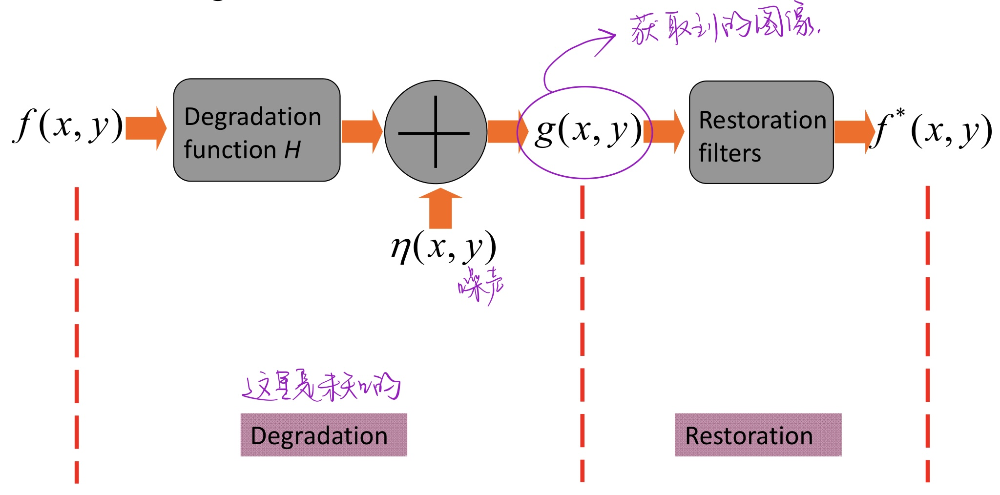
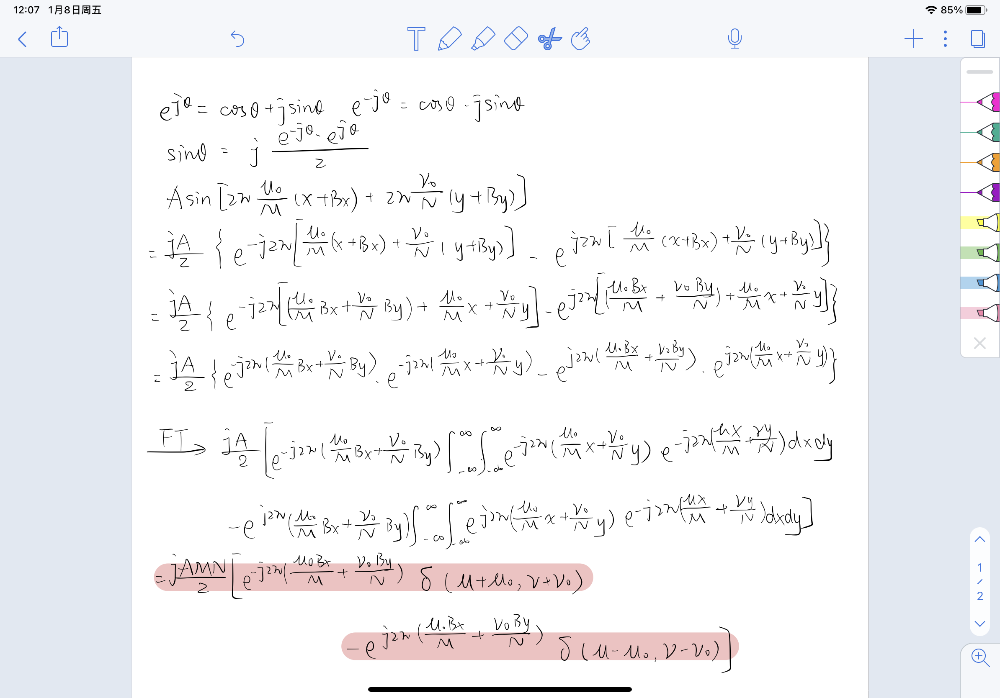

#         第5章-图像重建

[toc]

## 5.1 图像重建定义

* 作用：重建退化的图片
* 机制：识别图片退化过程，然后有针对性地去除，比图像加强更客观一些
* 与图像增强的对比
  * 图像增强更主观，面向的是人眼感受
  * 图像复原更客观，面向的是退化模型


## 5.2 图像退化过程模型



* $f(x,y)$ 输入图像
* $h(x,y)$ 退化函数的空间表示-但是这里我们先不考虑h的影响
* $\eta(x,y)$ 噪声项-只对噪声项做处理

$$
G(\mu,\nu)=F(\mu,\nu)H(\mu,\nu)+N(\mu,\nu)
$$


## 5.3 噪声模型

数字图像的噪声主要来自于图像的获取和传输过程
$$
g(x,y)=f(x,y)+\eta(x,y)
$$
如果能够识别图像中噪声的模型就可以确定如何去除噪声

### 5.3.1 几种常见的噪声模型

* 高斯噪声（Gaussian）
* 瑞利噪声（Rayleigh）
* 爱尔兰（伽马）噪声（Erlang）
* 指数噪声
* 均匀噪声（uniform）
* 冲击噪声 （impulse）


### 5.3.2 周期噪声

$$
r(x,y)=A\sin[2\pi\mu_0(x+B_x)/M+2\pi\nu(y+B_y)/N]
$$

进行傅立叶变换后得到
$$
R(\mu,\nu)=j\frac{AMN}{2}[e^{-j2\pi\mu_0B_x/M}\delta(\mu+\mu_0,\nu+\nu_0)-e^{j2\pi\nu_0 B_y/N}\delta(\mu_0-\mu_0,\nu-\nu_0)]
$$
变换过程



## 5.4 去噪

* 随机的加性噪声：空间滤波
* 周期性的噪声：频域滤波

### 5.4.1 空间滤波去噪

#### 5.4.1.1 均值滤波

##### 1. 算数均值滤波

$$
\hat f(x,y)=\frac{1}{mn}\sum_{(s,t)\in S_{xy}}g(s,t)
$$

* 缺点：会将图片变模糊

##### 2. 几何均值滤波

$$
\hat f(x,y)=[\prod_{(s,t)\in S_{xy}}g(s,t) ]^{\frac{1}{mn}}
$$

* 优点：细节损失较少，去噪效果和算数差不多

##### 3. 谐波均值滤波

$$
\hat f(x,y)=\frac{mn}{\sum_{(s,t)\in S_{xy}}\frac{1}{g(s,t)}}
$$

* 优点：对于盐粒噪声和高斯噪声去噪效果很好
* 缺点：不适于胡椒噪声

##### 4. 逆谐波均值滤波

$$
\hat f(x,y)=\frac{\sum_{(s,t)\in S_{xy}}g(s,t)^{Q+1}}{\sum_{(s,t)\in S_{xy}}g(s,t)^{Q}}
$$

* Q>0 处理胡椒噪声
* Q<0 处理盐粒噪声

🎍几何均值滤波和算数均值滤波适合处理高斯噪声和随机噪声

🎍逆谐波均值滤波适合处理脉冲噪声

#### 5.4.1.2 统计排序滤波器

##### 1. 中值滤波

* 周围窗口像素值排序，取中间值替换目标点
* 单极或双极脉冲

##### 2. 最大值最小值滤波

* 顾名思义
  * 最大值去掉的是胡椒噪声
  * 最小值去掉的是盐粒噪声

##### 3. 中点滤波

* 计算最大值和最小值的平均
* 随机分布噪声

##### 4. 修正的阿尔法均值滤波

* 去掉一部分最大值，去掉一部分最小值，剩下的取算数平均

$$
\hat f(x,y)=\frac{1}{mn-d}\sum_{(s,t)\in S_{xy}}g_r(s,t)
$$

* 当d=0时，退化为算数均值滤波
* 当d=nm-1时，退化为中值滤波
* 高斯噪声和椒盐混合噪声

#### 5.4.1.3 自适应滤波器

作用：去除脉冲噪声、平滑其他噪声、减少失真

* $z_{min}$ 窗口中灰度最小值
* $z_{max}$ 窗口中灰度最大值
* $z_{med}$ 窗口中灰度中间值
* $z_{xy}$ (x,y)处的值
* $S_{max}$ 最大允许的窗口大小

```c
Stage: A
	A1=Zmed-Zmin
	A2=Zmed-Zmax
	if(A1>0&&A2<0)// the median is not an impulse
		GOTO Stage B
	else
		increase the window size
	if(window size<Smax)
		GOTO Stage A
	else return Zmed
	
Stage: B
	B1=Zxy-Zmin
	B2=Zxy-Zmax
	if(B1>0&&B2<0)//the medain is not an impulse
		return Zxy
  else return Zmed
```


### 5.4.2 频域滤波去噪

#### 5.4.2.1 带阻滤波器

##### 1. 理想的带阻滤波器

$$
H(\mu,\nu)=\left\{
	\begin{align}
		0& \ if\  D_0-\frac{W}{2}\leq D(\mu,\nu)\leq D_0+\frac{W}{2}\\
		1& \ otherwise
	\end{align}
	\right.
$$


##### 2. butterworth带阻滤波器

$$
H(\mu,\nu)=\frac{1}{1+{[\frac{WD(\mu,\nu)}{D^2(\mu,\nu)-D_0^2}}]^{2n}}
$$


##### 3. 高斯带阻滤波器

$$
H(\mu,\nu)=1-e^{-[\frac{D^2(\mu,\nu)-D_0^2}{WD(\mu,\nu)}]^2}
$$


#### 5.4.2.2 带通滤波器

$$
H_{BP}=1-H_{BR}
$$


#### 5.4.2.3 陷阱滤波器

阻拦或允许通过特定预设频率范围的信号

关于原点对称

Notch reject filter
$$
H_{NR}(\mu,\nu)=\prod_{k-1}^{Q}H_k(\mu,\nu)H_{-k}(\mu,\nu)
$$

$$
D_k^2(\mu,\nu)=(\mu-\mu_k)^2+(\nu-\nu_k)^2
$$

$$
D_{-k}^2(\mu,\nu)=(\mu+\mu_k)^2+(\nu+\nu_k)^2
$$

Notch pass filter 就是1-NRF


```
Step 1:对图像进行傅立叶变换，在频域上观察其特征
Step 2:找到频域上的闪光点
Step 3:设计相应的陷阱滤波器
Step 4:HF得到结果
Step 5:转回时域
```

