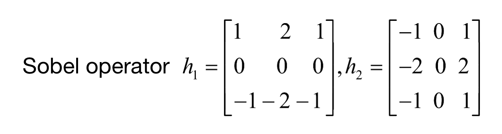
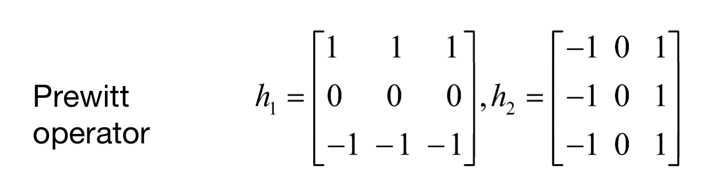
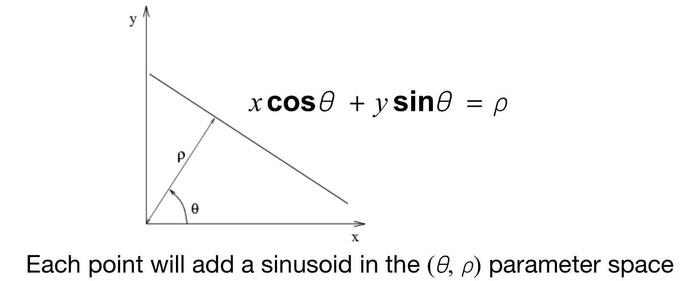

# 第6章-图像分割

[toc]

##   6.1 基础知识

图像分割的目的是将图片中一些像素点与其他的分离开来

一般来说是图像处理中的第一步

有三种不同类型的图像灰度级不连续

* 点
* 线
* 边缘

## 6.2 孤立点监测

* 图像和拉普拉斯算子进行卷积

* 对得到的结果做以下阈值处理
  $$
  g(x,y)=\left\{
  	\begin{align}
  		1,&if|R(x,y|\geq T\\
  		0,&otherwise
  	\end{align}
  \right.
  $$

## 6.3 边缘检测

### 6.3.1 导致边缘的几个原因

* 深度不连续：如一个表面遮盖另一个表面的一部分
* 表面方向的不连续：如一栋大楼的不同面
* 反射不连续：如颜色或材质不同
* 光照不连续：如阴影

### 6.3.2 基础边缘检测

#### 1. 一维

边缘点处的一阶导数为极值，如下图

#### 2. 二维

 二维情况下一阶导数用梯度来表示
$$
\bigtriangledown f(\frac{\partial f}{\partial x},\frac{\partial f}{\partial y})\\
||\bigtriangledown f||=\sqrt{(\frac{\partial f}{\partial x})^2+(\frac{\partial f}{\partial y})^2}\\
\theta = arctan2(\frac{\frac{\partial f}{\partial y}}{\frac{\partial f}{\partial x}})
$$
 可以通过梯度算子来计算二维梯度

##### Sobel operator

##### Prewott operator

❓为什么这些算子的元素和为0？因为对于平滑的没有边缘的地方，它们应该没有响应

##### 6.3.2.1 有噪声的情况

有限差分滤波器对噪声很敏感，有噪声的图片，像素之间会差距比较大，噪声越大，差距越大，所以在求导数之前应该先平滑一下图片

卷积的导数有如下性质
$$
\frac{d}{dx}(f*g)=f*\frac{d}{dx}g
$$
所以，可以将它变为

### 6.3.3 高级边缘检测

#### 1. Marr-Hildreth 边缘检测器

##### LoG

##### DoG

##### 算法过程如下

* 先用高斯低通滤波器进行滤波
* 利用拉普拉斯算子计算二阶导数
* 找到过零点（邻域里面有两个相对的像素符号相反，且差值的绝对值大于预设的阈值时认为该点是过零点）

🌟前两步可以用LoG替代，LoG和DoG等价

#### 2. Canny边缘检测器

##### 基本步骤

1. 用高斯函数进行平滑滤波
2. 计算梯度幅值图像和角度图像
3. 对梯度幅值图像应用非最大抑制
4. 用双阈值处理和连接分析来检测并连接断开的边缘

## 6.4 基于阈值的分割

### 6.4.1 基础知识

我们可以通过阈值分割来将图片上的物体从背景中分离出来（亮物体暗背景或亮背景暗物体），如下式
$$
g(x,y)=
\left\{
	\begin{align}
	1,&if\ f(x,y)>T\\
	0,&otherwise
	\end{align}
\right.
$$
对于亮背景暗物体，如果阈值设的太高，可能会把不是物体的阴影部分也框成物体

相反，如果阈值设的太低，可能会有一部分物体没被框进来

但是，这是很理想的做法，对于有噪声或者光照不均匀的图片，可能很难找到一个阈值来区分物体和背景，主要的影响因素有如下几点：

* 直方图上峰值之间的距离
  * 越远越好区分
* 噪声
* 光照分布
* 反射

### 6.4.2 基础的全局阈值处理

* 原理：用一个阈值分割整个图像
* 过程：
  * 选择一个预估的阈值T（一般是平均灰度级）
  * 用这个阈值T将图像的像素点分割成两部分G1和G2
  * 分别计算两部分的平均灰度m1和m2
  * T=（m1+m2）/2
  * 重复上述步骤知道两次T之差小于预设的$\Delta T$

### 6.4.3 Otsu方法的最佳全局阈值处理

#### 6.4.3.1 类间方差

$$
\sigma_B^2=P_1(k)[m_1(k)-m_G]^2+P_2(k)[m_2(k)-m_G]^2
$$

$m_1(k)$ 表示灰度值小于k的像素点的平均值

$P_1(k)$ 表示灰度值小于k的像素点的出现概率

$m_G$ 表示整体的平均灰度值

#### 6.4.3.2 步骤

* 计算图像的灰度直方图
* 计算图像的灰度平均值$m_G$
* 对于图像上各个灰度级k，计算上述类间方差$\sigma_B^2$
* 找到$\sigma_B^2$的最大值及其对应的k*
* 用k*做阈值处理

### 6.4.4 可变阈值处理

#### 6.4.4.1 动机

一些影响因素，如噪声，不均匀光照等可能会影响全局阈值处理的效果，因为它没有考虑到局部的特性，此时就需要用到可变阈值处理。

#### 6.4.4.2 过程

* 对图像上的每个像素点，分别计算它周围邻域内的像素移动平均值$m_{xy}$和标准差$\sigma_{xy}$
* 计算局部阈值$T_{xy} = a\sigma_{xy}+bm_{xy}$
* 利用局部阈值对图像进行阈值处理

#### 6.4.4.3 移动平均值

## 6.5 霍夫变换

### 6.5.1 投票机制

* 让每个特征点都投票给和它相关的模型
* 噪声点不会集中地给某个模型投票
* 缺失的数据不会影响某个模型

### 6.5.2 霍夫变换

图像空间的一条线在霍夫参数空间就是一个点

图像空间中的一个点在霍夫参数空间里就是一条线

霍夫参数空间中两条线的交点就是相对应两个点的连线

但是斜率和截距参数空间表示点和线有个问题，就是m和b的取值范围是正负无穷，解决这个问题的办法就是将图像转入极坐标

原理
$$
x=\rho \cos\theta\\
y=\rho \sin\theta\\
x\cos+y\sin=\rho\cos^2\theta+\rho\sin^2\theta=\rho
$$

### 6.5.3 霍夫变换+投票机制=边缘检测

* 初始化H全部为0
* 对于每个像素点，令$\theta$从-90到90变化，计算对应的$\rho=x\cos\theta+y\sin\theta$，给相应的$H(\theta,\rho)$投票
* 找到最大值$H$对应的$\theta 和\rho$

当然，当我们检测到边缘点的时候，我们就知道它的梯度方向是什么了，就不用从-90到90一个一个去算了，就可以直接用梯度方向和水平方向的夹角来算了。

#### 曲线检测

* 找到所有n个参数，表示为n维向量**a**
* 写出对应的n维累加器A
* 对于每个点，计算出所有它匹配的模型，对应的累加器加一
* 找出最大的累加器对应的模型

#### 霍夫变换的优缺点

优点

* 可以处理局部和遮挡
* 可以同时检测多个物体
* 对噪声具有鲁棒性

缺点

* 非物体形状可能在霍夫参数空间里形成虚假的峰值
* 时间复杂度较高
* 很难确定网格大小

