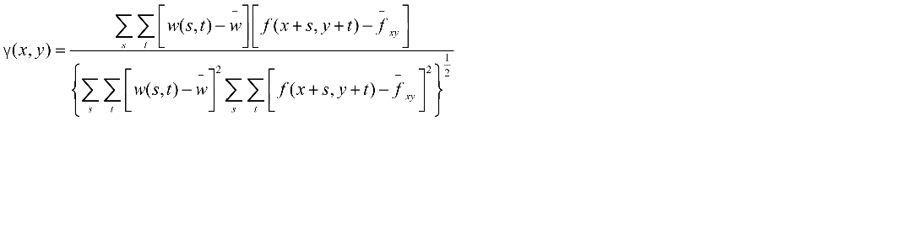
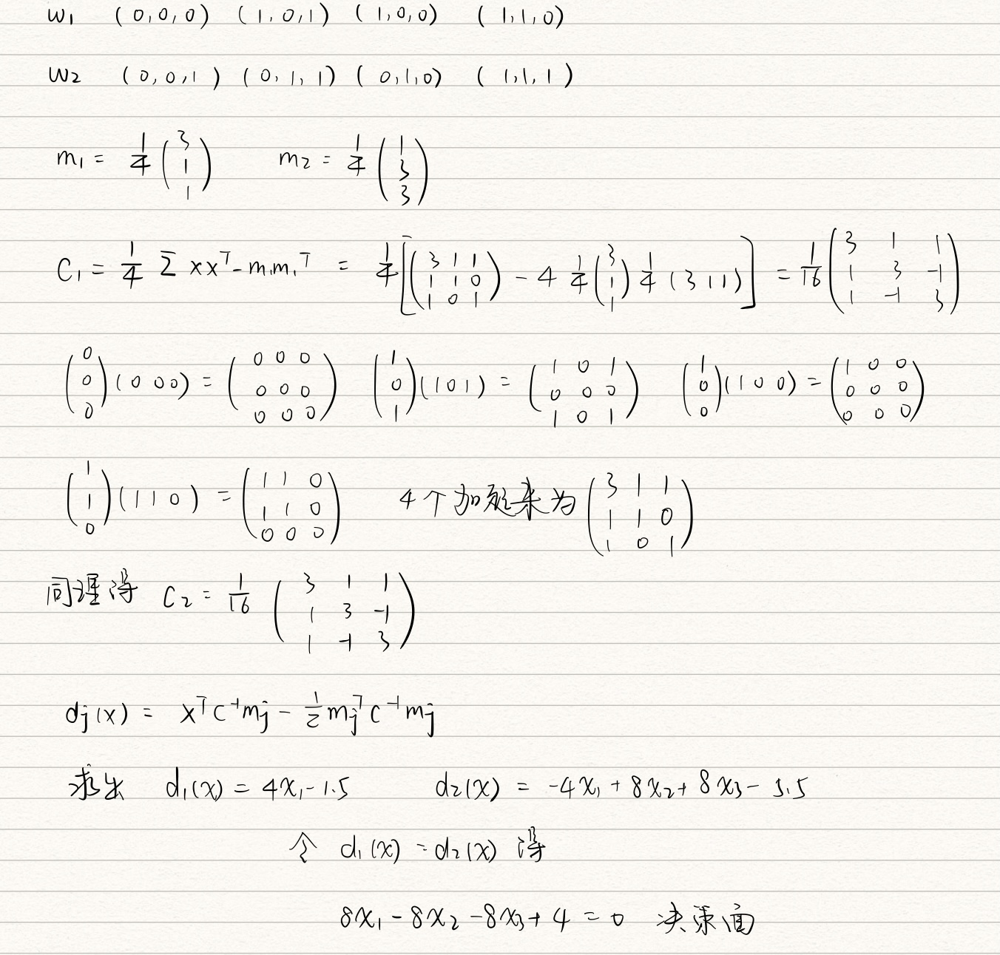

# 第七章-目标识别

[toc]

 ## 7.1 基础知识

目标识别的任务是检测出图片中感兴趣的物体，并对其进行分类

输入：图片

输出：框住的物体+分类的置信度

## 7.2 模式和模式分类

* 模式（pattern）：一堆描述子的集合
* 特征：描述子
* 模式类：一堆有共同属性的模式
* 模式向量：每个分量表示一个描述子

## 7.3 基于决策理论方法的识别

用**x**=$(x_1,x_2,...,x_n)^T$表示一个n维模式向量，对于有 W 个模式的模式类$w_1,w_2,...,w_W$决策理论模式识别的基本问题是根据如下属性来找到W个决策函数$d_1(x),d_2(x),...,d_W(x)$,如果**x**属于类$w_i$则
$$
d_i(x)>d_j(x)\ \ \ j=1,2,3,...,W;j\neq i
$$
即将x带入决策函数后，$d_i(x)$得到最大值，则称模式**x**属于第i个模式类

**决策边界**
$$
d_j(x)-d_i(x)=0
$$
或
$$
d_{ij}(x)=d_i(x)-d_j(x)=0
$$
对于模式i，$d_{ij}>0$，对于模式j，$d_{ij}<0$

### 7.3.1 最小距离分类器

将每个模式定义为该类模式的平均向量
$$
m_j=\frac{1}{N_j}\sum_{x\in\omega_j}x_j\ \ j=1,2,...,W
$$
欧氏距离定义如下
$$
D_j(x)=||x-m_j||\ \ j=1,2,...,W
$$
其中$||a||=(a^Ta)^{1/2}$是欧几里得范数

若$D_j$是最小距离，就把x赋给$w_j$，也即等同于计算如下函数的最大值
$$
d_j(x)=x^Tm_j-\frac{1}{2}m_j^Tm_j\ \ \ j=1,2,...,W
$$
当$d_j(x)$获得最大值的时候，就将x赋给$w_j$

**决策边界**
$$
d_{ij}=d_i(x)-d_j(x)=x^T(m_i-m_j)-\frac{1}{2}(m_i-m_j)^T(m_i+m_j)=0
$$
**举例说明**

### 7.3.2 相关匹配

### 7.3.3 最佳统计分类器

#### 7.3.3.1 贝叶斯分类器

* 判定一个模式**x**为模式$w_i$的概率记为$P(w_i|x)$
* 模式类$w_i$的先验概率为$P(w_i)$
* 记将模式x判断为$w_j$，但实际来自$w_i$的损失为$L_{ij}$

综上几点，当我们把一个模式x判断归为$w_j$类时，其平均损失为
$$
r_j(x)=\sum_{k=1}^{W}L_{kj}p(w_k|x)
$$
根据全概率公式$p(A/B)=[p(B/A)p(A)]/p(B)$
$$
r_j(x)=\frac{1}{p(x)}\sum_{k=1}^{W}L_{kj}p(x|w_k)p(w_k)
$$
🎍这样替换是因为我们已知先验概率$p(w_i)$

由于$\frac{1}{p(x)}$为正，且对所有$w_i$都一样，所以可以忽略它，因此平均损失简化为
$$
r_j(x)=\sum_{k=1}^{W}L_{kj}p(x|w_k)p(w_k)
$$
对于每一个x，计算所有$r_j(x)，j=1,2,...,W$将x赋给使损失最小的那个模式类

这种将总体损失降至最低的分类器我们成为**贝叶斯分类器**

#### 7.3.3.2 高斯模式类的贝叶斯分类器

如果一个类的概率密度是高斯分布的，那么其决策函数为
$$
d_j(x)=p(x|w_j)P(w_j)=\frac{1}{\sqrt{(2\pi)}\sigma_j}e^{-\frac{(x-m_j)^2}{2\sigma_j^2}}P(w_j)
$$
n维情况下
$$
p(x|w_j)=\frac{1}{(2\pi)^{n/2}|C_j|^{1/2}}e^{-\frac{1}{2}(x-m_i)^TC_j^{-1}(x-m_j)}​
$$
其中
$$
m_j=E_j\{x\}=\frac{1}{N_j}\sum_{x\in w_i}x
$$

$$
C_j=E_j\{(x-m_j)(x-m_j)^T\}=\frac{1}{N_j}\sum_{x\in w_j}xx^T-m_jm_j^T
$$

**举例**

给定一个3个特征的参数空间，上面的点及其分类如下，请计算决策边界

